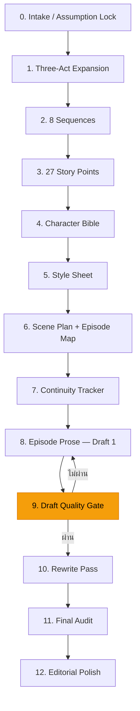

# 📖 Novel Writing Team

ระบบ AI Agent สำหรับเขียนนิยายภาษาไทยแบบครบวงจร — จาก synopsis สู่ต้นฉบับฉบับสมบูรณ์

ระบบนี้ออกแบบมาเพื่อใช้งานกับ **Codex Agent** (หรือระบบ AI Agent ที่รองรับ `.yaml` agent definitions) โดยใช้ทีม agent หลายตัวทำงานร่วมกันผ่าน workflow 13 ขั้นตอน ตั้งแต่การวางโครงเรื่อง สร้างตัวละคร เขียน draft แรก รีไรต์ ไปจนถึง editorial polish

---

## ✨ Features

- **Workflow อัตโนมัติ 13 ขั้น** — สั่งครั้งเดียว ระบบเดินต่อจนจบ polished draft
- **Agent เฉพาะทาง 14 ตัว** — แยกหน้าที่ชัด ตั้งแต่วางโครง เขียนจริง ตรวจ continuity ไปจนถึงเกลาภาษา
- **Quality Gate System** — ตรวจคุณภาพ prose อัตโนมัติทุกขั้นหลัก ย้อนแก้ได้สูงสุด 2 รอบ
- **Anti-Template Protection** — กฎเด็ดขาดป้องกัน agent เขียนซ้ำโครงสร้าง หรือสร้าง editorial commentary แทนนิยายจริง
- **Flexible Novel Sizing** — รองรับนิยายทุกขนาด ตั้งแต่เรื่องสั้น 5 ตอน ถึงนิยายยาว 40+ ตอน
- **Character Bible + Dialogue Fingerprint** — ตัวละครมีมิติ แยกเสียงพูดได้ชัด
- **Sensory Prose** — บรรยายผ่าน ภาพ เสียง กลิ่น รส สัมผัส ในมุมมองตัวละคร
- **Continuity Tracking** — ติดตามไทม์ไลน์ สถานะตัวละคร ความสัมพันธ์ และ open loops ตลอดเรื่อง

---

## 📁 โครงสร้างโปรเจกต์

```
novel-writing-team/
├── SKILL.md                    # คำอธิบายทักษะของระบบ (agent skill file)
├── synopsis.text               # ตัวอย่าง synopsis ตั้งต้น
│
├── agents/                     # Agent definitions (YAML)
│   ├── openai.yaml             # 🎯 Entry point หลัก — "ทีมเขียนนิยาย"
│   ├── orchestrator.yaml       # ผู้คุมโปรเจกต์ ควบคุม workflow ทั้งหมด
│   ├── chapter-writer.yaml     # เขียนนิยายจริงหนึ่งตอนต่อไฟล์
│   ├── rewrite-agent.yaml      # รีไรต์และเกลา prose
│   ├── continuity-agent.yaml   # ตรวจ continuity + prose quality monitoring
│   ├── editor-agent.yaml       # ตรวจงานเชิง editorial
│   ├── episode-planner.yaml    # จัดฉากลงตอน คุมความยาว
│   ├── character-agent.yaml    # สร้าง character bible
│   ├── scene-agent.yaml        # วาง scene plan
│   ├── synopsis-agent.yaml     # ซ่อม/ขยาย synopsis
│   ├── three-act-agent.yaml    # ขยายเป็น 3 องก์
│   ├── sequence-agent.yaml     # แตกเป็น 8 sequences
│   ├── story-points-agent.yaml # แตกเป็น 27 story points
│   └── worldbuilding-agent.yaml # สร้าง world bible
│
├── references/                 # เอกสารอ้างอิงสำหรับ agent
│   ├── start-here.md           # 🚀 คู่มือเริ่มต้นใช้งาน
│   ├── workflow.md             # สัญญาการทำงาน 13 ขั้น
│   ├── longform.md             # เกณฑ์ขนาดนิยาย 3 ระดับ
│   ├── output-templates.md     # เทมเพลตผลลัพธ์ทุกขั้น
│   ├── examples.md             # ตัวอย่างการใช้งาน + Prose ถูก/ผิด
│   ├── editor-checklist.md     # Checklist ตรวจงาน (รวม Prose Authenticity)
│   ├── style-guide.md          # แนวทางการเขียน
│   ├── character-design.md     # หลักการออกแบบตัวละคร
│   ├── first-appearance-guide.md # วิธีเปิดตัวตัวละคร/สถานที่ครั้งแรก
│   ├── rewrite-pass.md         # แนวทางการรีไรต์
│   ├── final-audit.md          # แนวทาง final audit
│   ├── editorial-polish.md     # แนวทาง editorial polish
│   ├── runbook.md              # คู่มือดำเนินงาน
│   └── ...                     # อ้างอิงเฉพาะทางอื่นๆ
│
├── manuscript/                 # ผลงานนิยาย
│   ├── projects/               # โปรเจกต์นิยายทั้งหมด
│   │   ├── index.md            # สารบัญโปรเจกต์
│   │   └── [project-slug]/     # โฟลเดอร์ของแต่ละโปรเจกต์
│   │       ├── README.md
│   │       ├── series-bible.md
│   │       ├── three-act.md
│   │       ├── characters.md
│   │       ├── scenes.md
│   │       ├── episode-map.md
│   │       ├── continuity.md
│   │       ├── episodes/       # ไฟล์ Metadata และแผนงานรายตอน
│   │       └── ...
│   └── templates/              # เทมเพลตสำหรับสร้างโปรเจกต์ใหม่
│
├── output/                     # โฟลเดอร์เก็บไฟล์เนื้อหานิยายที่พร้อมอ่าน (Prose)
│   └── [project-slug]/         # แยกตามชื่อเรื่อง
│       ├── ep-01-[slug].md
│       └── ...
│
└── tools/
    └── new-project.mjs         # สคริปต์สร้างโปรเจกต์ใหม่
```

---

## 🚀 เริ่มต้นใช้งาน

### 1. สร้างโปรเจกต์ใหม่

```bash
node tools/new-project.mjs my-novel-slug "ชื่อเรื่องชั่วคราว"
```

ระบบจะสร้างโฟลเดอร์ `manuscript/projects/my-novel-slug/` พร้อมไฟล์เทมเพลตทั้งหมดให้

### 2. สั่งเริ่มเขียนแบบครบ workflow (ครั้งเดียวจบ)

ส่งข้อความนี้ให้ agent:

```
ใช้ทีมเขียนนิยายนี้ช่วยฉันพัฒนาจากเรื่องย่อนี้ไปเป็นนิยายเต็มเรื่อง
และเริ่มทำได้เลยจนจบ polished draft

ข้อมูลตั้งต้น:
- ชื่อเรื่องชั่วคราว: [ชื่อ]
- แนวเรื่อง: [แนว]
- โทนเรื่อง: [โทน]
- กลุ่มเป้าหมาย: [กลุ่ม]
- เรื่องย่อ: [synopsis ของคุณ]
- จำนวนตอนเป้าหมาย: [จำนวน หรือ "ให้ระบบประเมิน"]
- สิ่งที่อยากให้มี: [ใส่]
- สิ่งที่ห้ามมี: [ใส่]
```

### 3. หรือสั่งทีละขั้น

```
จาก synopsis นี้ ช่วยขยายเป็น Act 1, Act 2, Act 3
```

```
จากโครงสามองก์นี้ ช่วยแตกเป็น 8 sequences
```

ดูคำสั่งเพิ่มเติมได้ที่ [`references/start-here.md`](references/start-here.md)

---

## 📐 ขนาดนิยายที่รองรับ

ระบบรองรับนิยาย 3 ขนาด — ผู้ใช้สามารถระบุจำนวนตอนเอง หรือปล่อยให้ agent ประเมินจาก synopsis:

| ขนาด | จำนวนตอน | ความยาวรวม | เหมาะกับ |
|------|----------|-----------|---------|
| เรื่องสั้น | 5-10 ตอน | 15,000-30,000 คำ | พล็อตเดี่ยว ตัวละคร 1-2 คน |
| ขนาดกลาง | 12-24 ตอน | 35,000-70,000 คำ | มี subplot 1-2 เส้น |
| เรื่องยาว | 25-40 ตอน | 75,000-120,000+ คำ | หลาย subplot, world-building ซับซ้อน |

ดูรายละเอียดที่ [`references/longform.md`](references/longform.md)

---

## ⚙️ Workflow 13 ขั้นตอน



**โหมดการทำงาน:**
- **Run-through mode** (ค่าเริ่มต้น) — สั่งครั้งเดียว agent เดินจนจบ
- **Approval mode** — สั่งทีละขั้น อนุมัติทุกจุด

---

## 🛡️ Quality Gate System

ระบบจะตรวจสอบคุณภาพอัตโนมัติทุกขั้นหลัก:

| เกณฑ์ | รายละเอียด |
|-------|-----------|
| **Prose Authenticity** | ทุกย่อหน้าต้องเป็นเหตุการณ์จริงในเรื่อง ไม่ใช่ editorial commentary |
| **Anti-Template** | ห้ามโครงประโยคซ้ำข้ามตอน เปลี่ยนแค่ชื่อ |
| **Direct Dialogue** | ทุกตอนต้องมีบทพูดจริงอย่างน้อย 3 ช่วง |
| **Word Count** | จำนวนคำต้องอยู่ในช่วงเป้าหมาย ±20% |
| **Batch Consistency** | คุณภาพต้องไม่ตกลงระหว่าง batch แรกกับ batch หลัง |
| **Sensory Detail** | ต้องมีรายละเอียด ภาพ/เสียง/กลิ่น/รส/สัมผัส อย่างน้อย 5 จุดต่อตอน |

ถ้าไม่ผ่าน → agent ย้อนกลับแก้ สูงสุด **2 รอบ** ก่อนเดินต่อ

---

## 📚 เอกสารอ้างอิง

| ไฟล์ | เนื้อหา |
|------|--------|
| [`start-here.md`](references/start-here.md) | คู่มือเริ่มต้นและคำสั่งพร้อมใช้ |
| [`workflow.md`](references/workflow.md) | สัญญาการทำงานฉบับเต็ม |
| [`examples.md`](references/examples.md) | ตัวอย่าง output ทุกขั้น + Prose ถูก/ผิด |
| [`editor-checklist.md`](references/editor-checklist.md) | Checklist ตรวจงาน 9 หมวด |
| [`style-guide.md`](references/style-guide.md) | แนวทางการเขียนสำนวน |
| [`character-design.md`](references/character-design.md) | หลักการออกแบบตัวละคร |
| [`longform.md`](references/longform.md) | เกณฑ์ขนาดนิยาย + วิธีวางโครง |
| [`output-templates.md`](references/output-templates.md) | เทมเพลตมาตรฐานทุกขั้น |
| [`runbook.md`](references/runbook.md) | คู่มือดำเนินงานแบบละเอียด |

---

## 🏗️ โปรเจกต์ตัวอย่าง

| โปรเจกต์ | แนว | สถานะ |
|----------|-----|-------|
| `sample-project` | ตัวอย่างโครงสร้าง | เทมเพลต |
| `night-wardens` | แฟนตาซีมืด | Draft 1 ครบ 24 ตอน |
| `flame-of-forgetting` | แฟนตาซีผจญภัย | Draft 1 (36 ตอน) |
| `ayothaya-himmaphan` | แฟนตาซีไทย-หิมพานต์ | กำลังดำเนินการ |

---

## 💡 Tips

- **อยากได้เรื่องสั้น?** ระบุ `จำนวนตอนเป้าหมาย: 8` ระบบจะปรับโครงสร้างให้กระชับ
- **อยากได้นิยายยาว?** ระบุ `total word target: 120000` หรือบอกว่า "อยากได้เรื่องยาวเต็ม"
- **ไม่แน่ใจ?** ปล่อยให้ agent ประเมินจาก synopsis ของคุณ
- **มีแค่ไอเดีย?** ส่งไอเดียตั้งต้นมา agent จะขยายเป็น synopsis ก่อนแล้วเดินต่อเอง

---

## 📄 License

Private project — internal use only.
